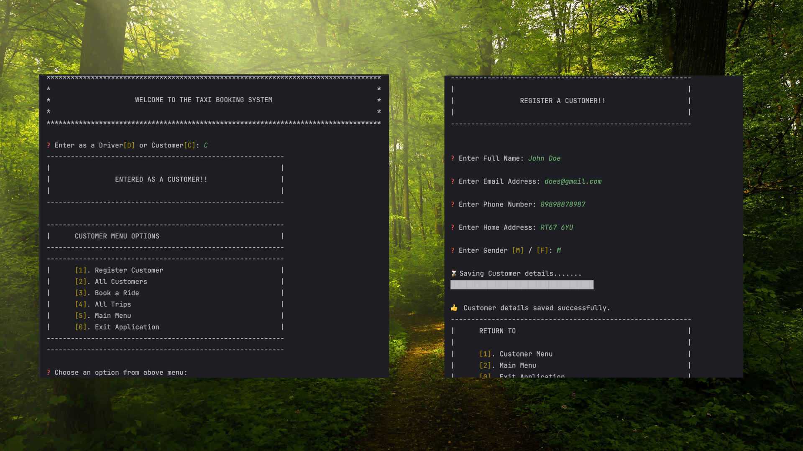

# Mini Taxi Booking App - Java CLI

 

## 📌 Introduction
A simple Command Line Interface (CLI) application for booking taxis, built using Java. This application allows users to book a taxi by entering their details and selecting the desired destination. The app simulates a basic taxi booking system, managing bookings and providing booking confirmation.

## ✨ Features
- Add, view, update, and delete drivers and customers 
- Book taxis  
- Manage trips 
- User-friendly command line interface  
